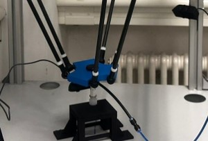
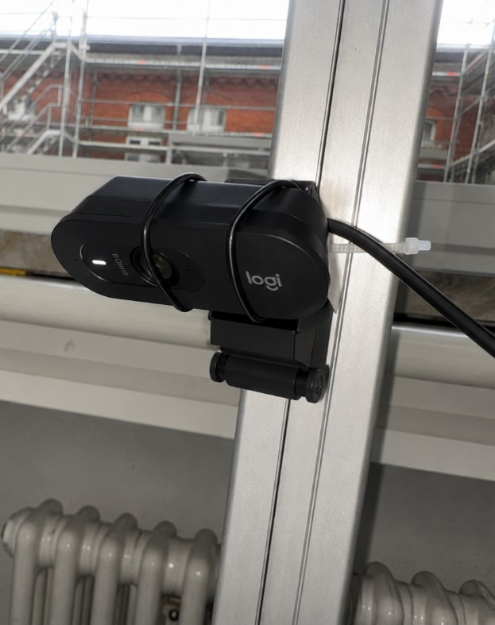
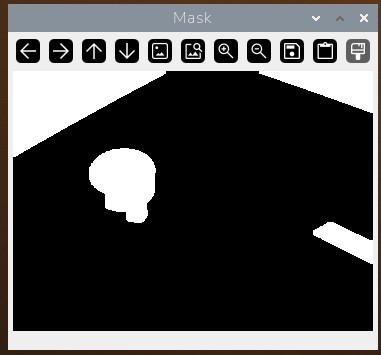
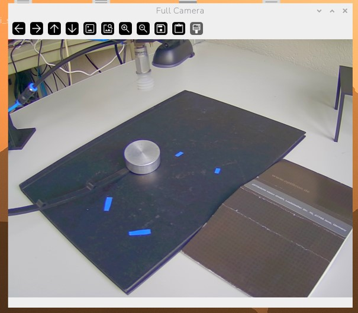
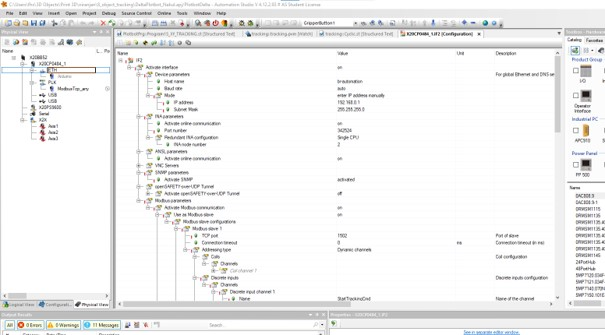
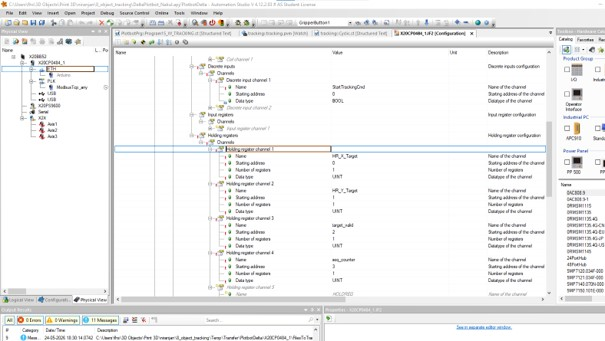
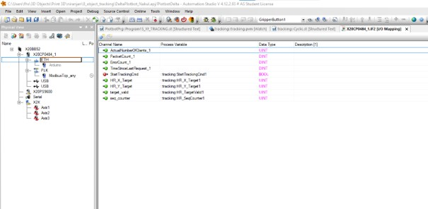
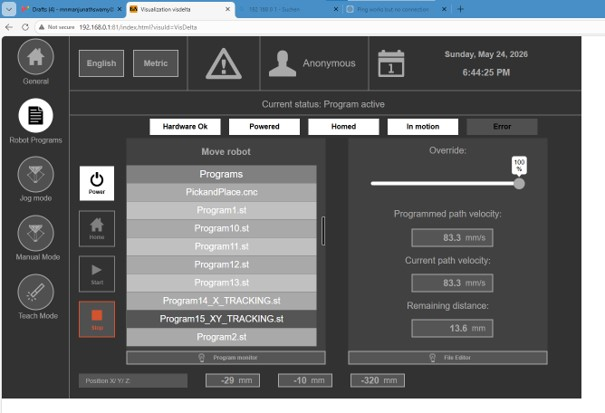

# Vision-Guided Delta Robot Tracking System

Real-time object tracking and vision-guided Delta Robot control using OpenCV, Raspberry Pi, B&R PLC, Modbus TCP communication, and Arduino-based gripper integration.

---

# Project Overview

This project presents a vision-guided robotic tracking system that enables a Delta Robot to follow a detected object in real time.

A Logitech USB camera mounted above the workspace continuously captures images of the target object. The Raspberry Pi processes the image stream using OpenCV, extracts the object position, converts image coordinates into robot coordinates through calibration, and transmits the target position to a B&R PLC via Modbus TCP communication.

The PLC executes motion control logic and commands the Delta Robot to track the object while maintaining predefined safety limits. The system demonstrates the integration of computer vision, industrial communication, PLC programming, and robotic motion control.

---

# System Architecture

```text
                    Logitech Camera
                           │
                           ▼
                 Raspberry Pi (OpenCV)
                           │
                           ▼
                Object Detection & Tracking
                           │
                           ▼
           Pixel-to-Robot Coordinate Conversion
                           │
                           ▼
                   Modbus TCP Protocol
                           │
                           ▼
                        B&R PLC
                           │
                           ▼
                  Motion Control Program
                           │
                           ▼
                       Delta Robot
                           │
                           ▼
                    Arduino Gripper
```

---

# Hardware Components

* Delta Robot
* Raspberry Pi
* Logitech USB Camera
* B&R PLC
* Arduino
* Gripper Mechanism
* Industrial HMI Interface

---

# Software Components

* Python
* OpenCV
* Modbus TCP
* B&R Automation Studio
* Structured Text (ST)
* Arduino IDE

---

# Experimental Setup

## Delta Robot Platform

The Delta Robot executes tracking commands received from the PLC.

<p align="center">
  
</p>

---

## Camera Setup

The Logitech USB camera mounted above the workspace captures images for object detection and tracking.

<p align="center">
  
</p>

---

# Vision Processing Pipeline

The Raspberry Pi performs the following operations:

1. Image Acquisition
2. Region of Interest (ROI) Extraction
3. HSV Thresholding
4. Morphological Filtering
5. Contour Detection
6. Ellipse Fitting
7. Object Center Estimation
8. Pixel-to-Robot Coordinate Transformation
9. Modbus TCP Data Transmission

---

# Object Detection

The object is segmented using HSV thresholding and morphological operations.

## Binary Mask Output

<p align="center">
 
</p>

The binary mask isolates the target object from the background and removes noise before contour extraction.

---

## Object Tracking Result

<p align="center">
  
</p>

The detected object center is used to calculate robot coordinates and generate tracking commands.

---

# Modbus TCP Communication

Communication between Raspberry Pi and B&R PLC is established using Modbus TCP.

The following data are exchanged:

| Register | Description             |
| -------- | ----------------------- |
| HR_X     | Robot X Coordinate      |
| HR_Y     | Robot Y Coordinate      |
| HR_VALID | Object Detection Status |
| HR_SEQ   | Sequence Counter        |

---

# PLC Configuration

## Modbus Server Configuration

<p align="center">
  
</p>

---

## Modbus Device Configuration

<p align="center">
  
</p>

---

## PLC Variable Mapping

<p align="center">
  
</p>

The PLC receives vision coordinates through mapped Modbus registers and updates robot target positions.

---

# Motion Control Logic

The motion control program performs:

* Reading vision coordinates
* Applying safety limits
* Generating tracking positions
* Executing robot motion
* Updating target coordinates continuously

The robot follows the object while maintaining a safe operating workspace.

---

# Human Machine Interface (HMI)

The HMI provides:

* Robot power control
* Program selection
* Motion monitoring
* Tracking operation
* Robot status visualization

<p align="center">
  
</p>

---

# Results

The developed system successfully demonstrates:

-> Real-time object detection

-> Robust contour-based tracking

-> Pixel-to-robot coordinate transformation

-> Raspberry Pi to PLC communication through Modbus TCP

-> PLC-based motion control

-> Vision-guided Delta Robot tracking

-> Stable tracking performance in laboratory conditions

---


# Technologies Used

* Python
* OpenCV
* Raspberry Pi
* B&R PLC
* Structured Text (ST)
* Modbus TCP
* Arduino
* Delta Robot
* HMI


# Author

**Zameer Hussain**

M.Eng Robotics

Computer Vision | Industrial Automation | Robotics

